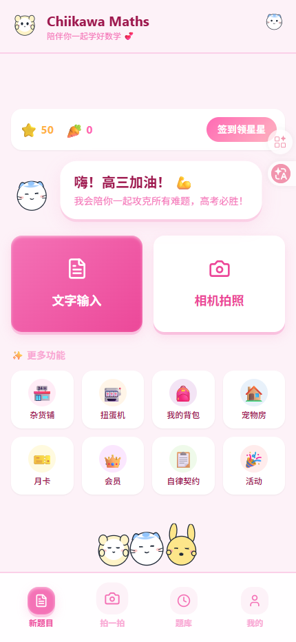
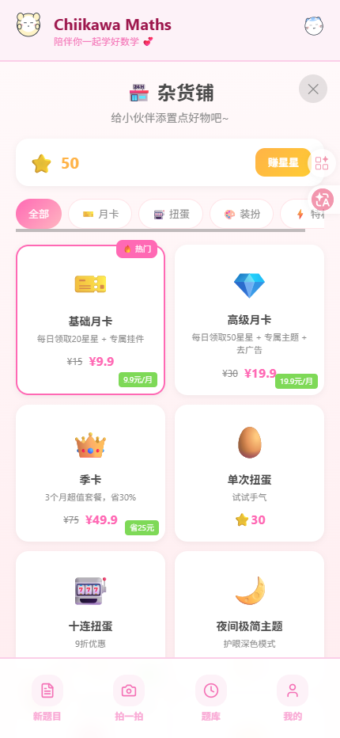
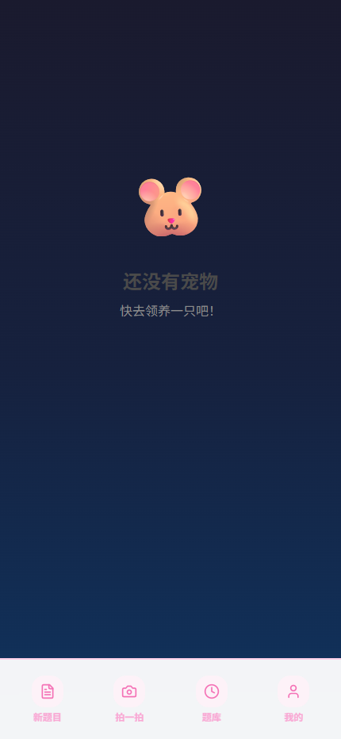

# ButterMath - AI 智能数学解题器

一款现代化的 PWA 数学解题应用，采用柔和舒适的"黄油熊"主题。

## 📱 应用预览

| 首页 | 杂货铺 | 宠物房 |
| ---- | ---- | ---- |
|  |  |  |

## 技术栈

### 后端
- **Python 3.12** + **uv** 包管理器
- **FastAPI** - 现代异步 Web 框架
- **Granian** - 高性能 ASGI 服务器
- **Gemini API** - Google AI 数学解题
- **Loguru** - 高级日志系统（自动轮转与保留）

### 前端
- **React 19** - 最新 React 并发特性
- **Vite 6** - 极速构建工具
- **Tailwind CSS v4** - 原子化 CSS 框架
- **Framer Motion** - 生产级动画库
- **Lucide React** - 精美图标库
- **TypeScript** - 类型安全开发

## 项目结构

```
buttermath/
├── backend/
│   ├── app.py              # FastAPI 应用（含生命周期管理）
│   ├── pyproject.toml      # Python 依赖（uv）
│   ├── .env.example        # 环境变量模板
│   └── logs/               # 应用日志（自动轮转）
├── frontend/
│   ├── src/
│   │   ├── components/     # 可复用 React 组件
│   │   ├── lib/           # 工具函数
│   │   ├── App.tsx        # 主应用
│   │   └── index.css      # Tailwind v4 主题变量
│   ├── package.json       # Node 依赖
│   └── vite.config.ts     # Vite 配置（含 API 代理）
├── Dockerfile             # 多阶段生产构建
├── docker-compose.yaml    # 生产级编排
├── Caddyfile             # 反向代理配置
└── .gitignore            # Git 忽略规则
```

## 快速开始

### 后端设置

```bash
cd backend

# 使用 uv 安装依赖
uv sync

# 复制环境变量文件
cp .env.example .env

# 编辑 .env 文件，添加你的 GEMINI_API_KEY

# 启动开发服务器
uv run python app.py
```

后端运行在 `http://localhost:8000`

### 前端设置

```bash
cd frontend

# 安装依赖
pnpm install

# 启动开发服务器
pnpm dev
```

前端运行在 `http://localhost:5173`，自动代理到后端 API

### 生产部署

```bash
# 使用 Docker Compose 构建并启动
docker-compose up -d

# 查看日志
docker-compose logs -f backend
docker-compose logs -f caddy

# 停止服务
docker-compose down
```

## 功能特性

### 后端功能
- ✅ **健康检查端点** - Docker 健康监控
- ✅ **日志轮转** - 10MB 自动切割，保留 7 天
- ✅ **临时文件清理** - finally 块保证清理
- ✅ **CORS 支持** - 可配置跨域
- ✅ **错误处理** - 完整错误响应

### 前端功能
- ✅ **移动优先设计** - PWA 体验优化
- ✅ **柔和粉彩主题** - 舒适的黄油熊配色
- ✅ **文字 & 相机输入** - 多种输入方式
- ✅ **实时解题** - AI 驱动数学求解
- ✅ **步骤显示** - 详细解题过程
- ✅ **历史记录** - 追踪过往题目
- ✅ **流畅动画** - Framer Motion 过渡效果
- ✅ **PWA 就绪** - 禁用缩放，应用级元标签

## 配色方案

### 柔和粉彩黄油熊主题
- **主色**: #F4E088（柔和黄油黄）
- **文字**: #8B4513（暖棕色）
- **背景**: #FFFDF5（奶油白）
- **粉色强调**: #FFB3BA
- **蓝色强调**: #BAE1FF
- **绿色强调**: #BFFCC6
- **薰衣草色**: #E0BBE4
- **桃色强调**: #FFDFBA

## API 端点

### 健康检查
```
GET /health
```
返回服务器状态和运行时间。

### 文字解题
```
POST /api/solve/text
Content-Type: application/json

{
  "problem": "2x + 5 = 15",
  "language": "zh"
}
```

### 图片解题
```
POST /api/solve/image
Content-Type: multipart/form-data

file: <image_file>
```

## 开发说明

### 后端日志
日志存储在 `backend/logs/` 目录，特性如下：
- 10MB 自动轮转
- 保留 7 天
- ZIP 压缩
- 同时输出到文件和控制台

### 环境变量
创建 `backend/.env` 文件：
```
GEMINI_API_KEY=你的API密钥
GEMINI_BASE_URL=https://你的中转商地址
PORT=8000
ENVIRONMENT=development
```

### Docker 健康检查
Dockerfile 内置健康检查：
```bash
HEALTHCHECK CMD curl --fail http://localhost:8000/health || exit 1
```

## 开源协议

MIT License

## 贡献指南

1. Fork 本仓库
2. 创建特性分支
3. 提交你的更改
4. 推送到分支
5. 开启 Pull Request

---

用 ❤️ 和柔和粉彩色彩打造
